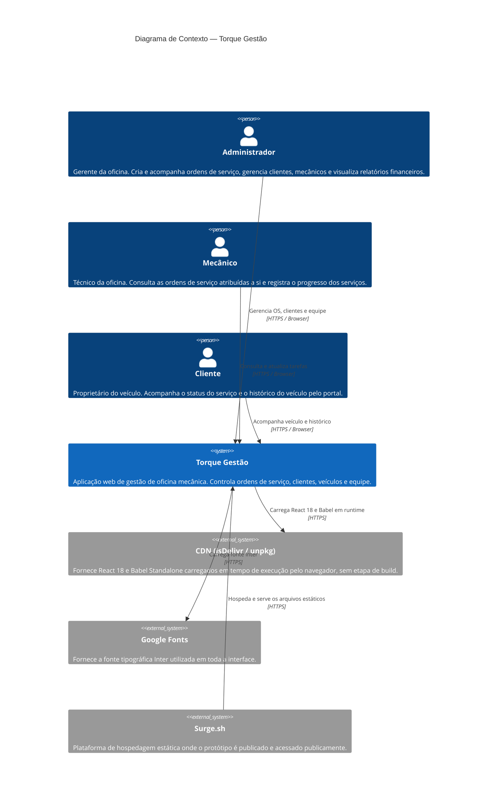
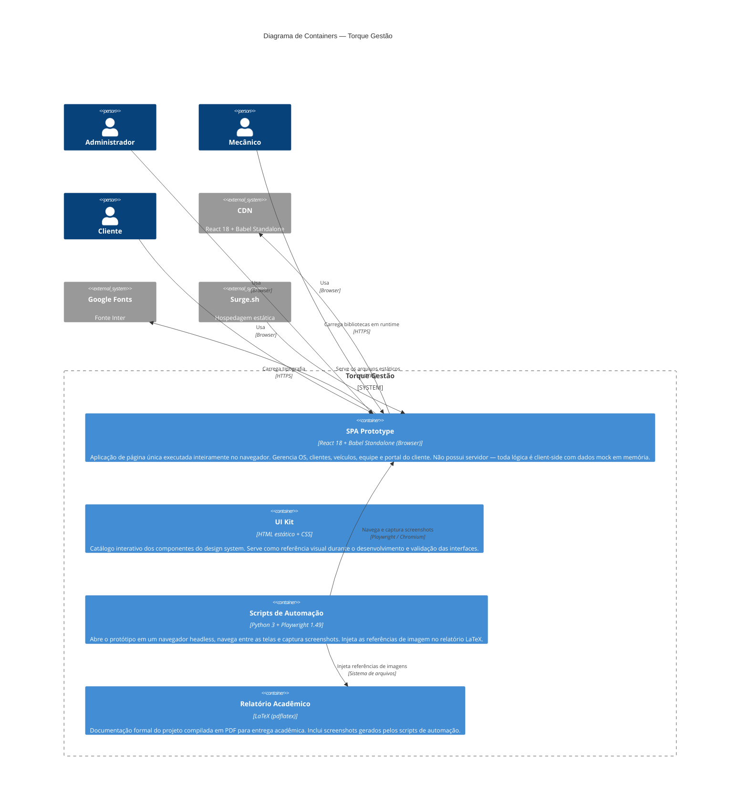
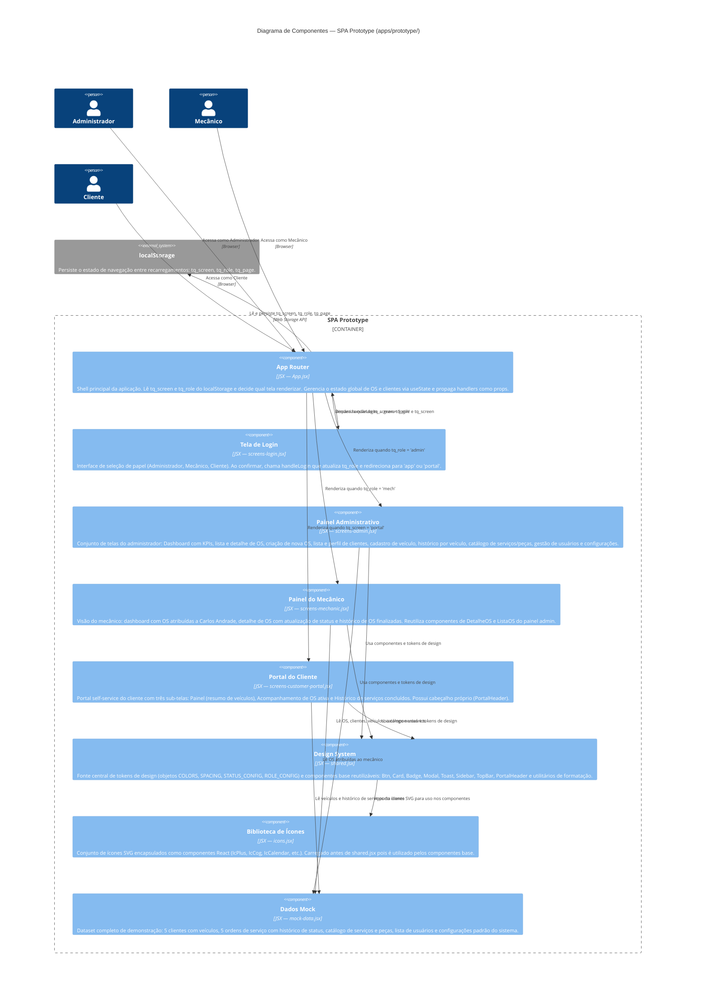

# Diagramas C4 — Torque Gestão

Diagramas de arquitetura do sistema segundo o modelo C4 (Context, Containers, Components).

---

## Nível 1 — Diagrama de Contexto

Visão macro do sistema, seus usuários e os sistemas externos com os quais interage.

---

## Nível 2 — Diagrama de Containers

Decomposição interna do sistema Torque Gestão em seus principais containers (aplicações e processos executáveis).

---

## Nível 3 — Diagrama de Componentes

Decomposição interna do container **SPA Prototype** (`apps/prototype/`) em seus componentes JSX. Os arquivos são carregados em ordem pelo `index.html` via `<script type="text/babel">`.

