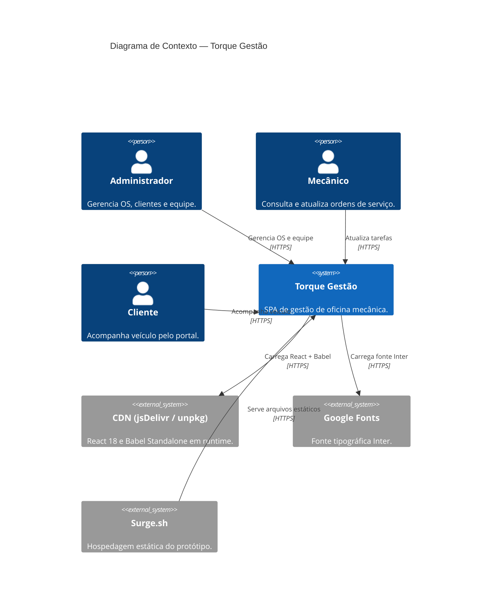

# C4 Nível 1 — Diagrama de Contexto

```mermaid
C4Context
    title Diagrama de Contexto — Torque Gestão

    Person(admin, "Administrador", "Gerencia OS, clientes e equipe.")
    Person(mecanico, "Mecânico", "Consulta e atualiza ordens de serviço.")
    Person(cliente, "Cliente", "Acompanha veículo pelo portal.")

    System(torque, "Torque Gestão", "SPA de gestão de oficina mecânica.")

    System_Ext(cdn, "CDN (jsDelivr / unpkg)", "React 18 e Babel Standalone em runtime.")
    System_Ext(fonts, "Google Fonts", "Fonte tipográfica Inter.")
    System_Ext(surge, "Surge.sh", "Hospedagem estática do protótipo.")

    Rel(admin, torque, "Gerencia OS e equipe", "HTTPS")
    Rel(mecanico, torque, "Atualiza tarefas", "HTTPS")
    Rel(cliente, torque, "Acompanha veículo", "HTTPS")
    Rel(torque, cdn, "Carrega React + Babel", "HTTPS")
    Rel(torque, fonts, "Carrega fonte Inter", "HTTPS")
    Rel(surge, torque, "Serve arquivos estáticos", "HTTPS")
```
