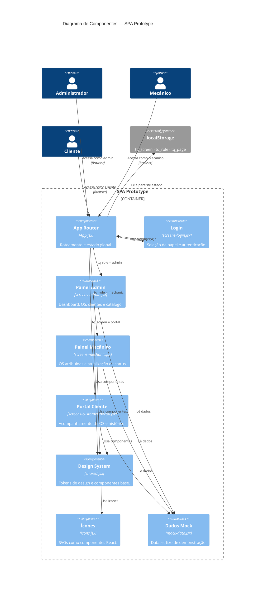

# C4 Nível 3 — Diagrama de Componentes

```mermaid
C4Component
    title Diagrama de Componentes — SPA Prototype

    Person(admin, "Administrador")
    Person(mecanico, "Mecânico")
    Person(cliente, "Cliente")

    System_Ext(ls, "localStorage", "tq_screen · tq_role · tq_page")

    Container_Boundary(spa, "SPA Prototype") {
        Component(router, "App Router", "App.jsx", "Roteamento e estado global.")
        Component(login, "Login", "screens-login.jsx", "Seleção de papel e autenticação.")
        Component(admin_s, "Painel Admin", "screens-admin.jsx", "Dashboard, OS, clientes e catálogo.")
        Component(mech_s, "Painel Mecânico", "screens-mechanic.jsx", "OS atribuídas e atualização de status.")
        Component(portal, "Portal Cliente", "screens-customer-portal.jsx", "Acompanhamento de OS e histórico.")
        Component(ds, "Design System", "shared.jsx", "Tokens de design e componentes base.")
        Component(icons, "Ícones", "icons.jsx", "SVGs como componentes React.")
        Component(mock, "Dados Mock", "mock-data.jsx", "Dataset fixo de demonstração.")
    }

    Rel(admin, router, "Acessa como Admin", "Browser")
    Rel(mecanico, router, "Acessa como Mecânico", "Browser")
    Rel(cliente, router, "Acessa como Cliente", "Browser")
    Rel(router, ls, "Lê e persiste estado")
    Rel(router, login, "tq_screen = login")
    Rel(router, admin_s, "tq_role = admin")
    Rel(router, mech_s, "tq_role = mechanic")
    Rel(router, portal, "tq_screen = portal")
    Rel(login, router, "handleLogin()")
    Rel(admin_s, ds, "Usa componentes")
    Rel(mech_s, ds, "Usa componentes")
    Rel(portal, ds, "Usa componentes")
    Rel(admin_s, mock, "Lê dados")
    Rel(mech_s, mock, "Lê dados")
    Rel(portal, mock, "Lê dados")
    Rel(ds, icons, "Usa ícones")
```
