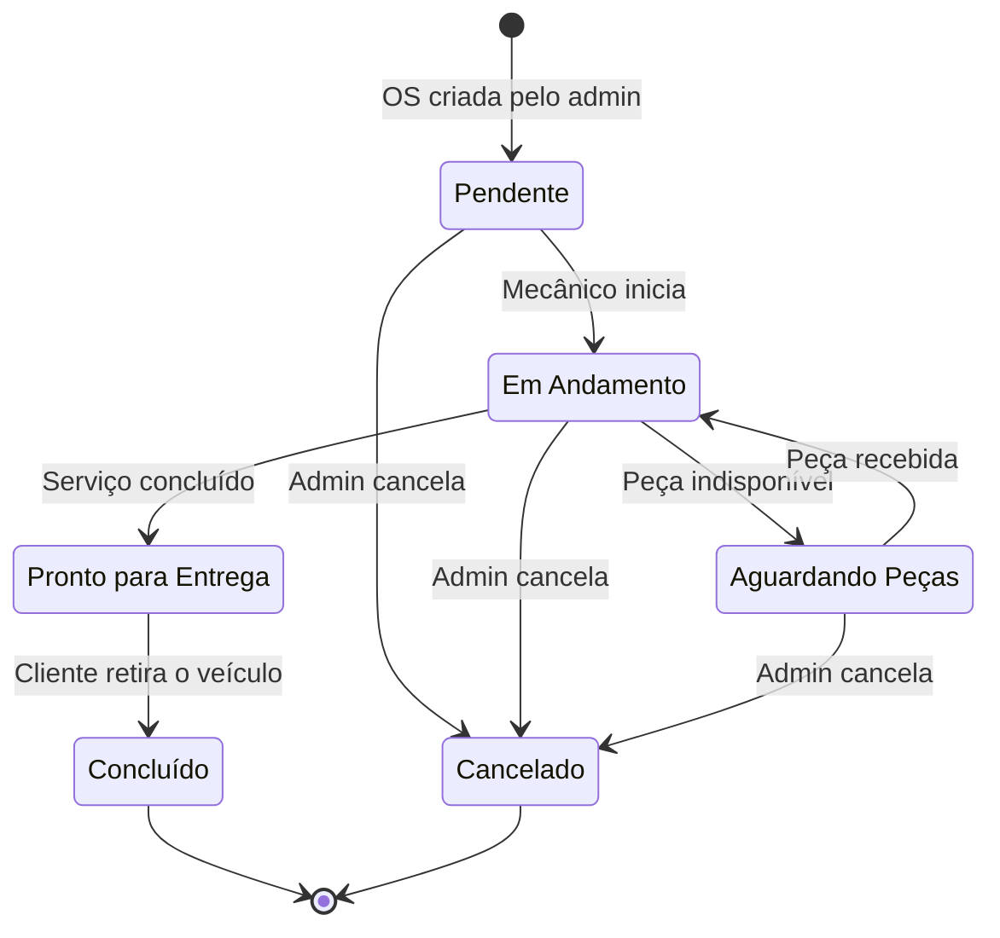

# Diagrama de Estados — Ciclo de Vida de uma Ordem de Serviço

```mermaid
stateDiagram-v2
    direction TB

    state "Pendente" as pendente
    state "Em Andamento" as em_andamento
    state "Aguardando Peças" as aguardando_pecas
    state "Pronto para Entrega" as pronto
    state "Concluído" as concluido
    state "Cancelado" as cancelado

    [*] --> pendente : OS criada pelo admin

    pendente --> em_andamento : Mecânico inicia
    em_andamento --> aguardando_pecas : Peça indisponível
    aguardando_pecas --> em_andamento : Peça recebida
    em_andamento --> pronto : Serviço concluído
    pronto --> concluido : Cliente retira o veículo

    pendente --> cancelado : Admin cancela
    em_andamento --> cancelado : Admin cancela
    aguardando_pecas --> cancelado : Admin cancela

    concluido --> [*]
    cancelado --> [*]
```
