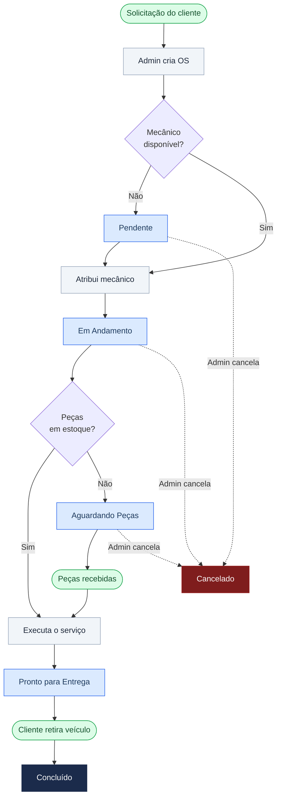

# Fluxograma — Processo de uma Ordem de Serviço

```mermaid
flowchart TD
    classDef evento  fill:#DCFCE7,stroke:#16A34A,color:#14532D
    classDef status  fill:#DBEAFE,stroke:#2563EB,color:#1E3A5F
    classDef acao    fill:#F1F5F9,stroke:#94A3B8,color:#1E293B
    classDef fim_ok  fill:#1B2B4B,stroke:#1B2B4B,color:#FFFFFF
    classDef fim_no  fill:#7F1D1D,stroke:#991B1B,color:#FFFFFF

    A([Solicitação do cliente]):::evento
    B[Admin cria OS]:::acao
    C{Mecânico\ndisponível?}
    D[Pendente]:::status
    E[Atribui mecânico]:::acao
    F[Em Andamento]:::status
    G{Peças\nem estoque?}
    H[Aguardando Peças]:::status
    I([Peças recebidas]):::evento
    J[Executa o serviço]:::acao
    K[Pronto para Entrega]:::status
    L([Cliente retira veículo]):::evento
    M[Concluído]:::fim_ok
    N[Cancelado]:::fim_no

    A --> B --> C
    C -- Não --> D --> E
    C -- Sim --> E
    E --> F --> G
    G -- Sim --> J
    G -- Não --> H --> I --> J
    J --> K --> L --> M

    D -. Admin cancela .-> N
    F -. Admin cancela .-> N
    H -. Admin cancela .-> N
```
