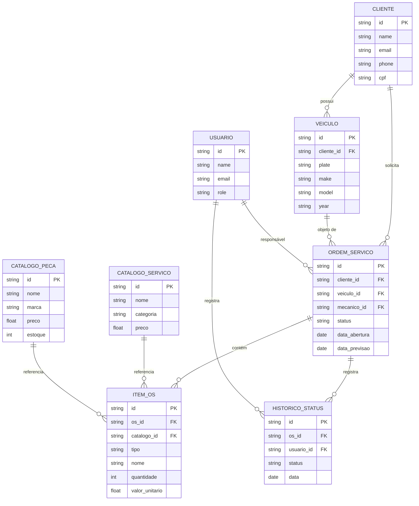

# Modelo Entidade-Relacionamento

> Baseado nas entidades definidas em `apps/prototype/src/mock-data.jsx`.

```mermaid
erDiagram
    CLIENTE {
        string id     PK
        string name
        string email
        string phone
        string cpf
    }

    VEICULO {
        string id         PK
        string cliente_id FK
        string plate
        string make
        string model
        string year
    }

    USUARIO {
        string id    PK
        string name
        string email
        string role
    }

    ORDEM_SERVICO {
        string id          PK
        string cliente_id  FK
        string veiculo_id  FK
        string mecanico_id FK
        string status
        date   data_abertura
        date   data_previsao
    }

    ITEM_OS {
        string id          PK
        string os_id       FK
        string catalogo_id FK
        string tipo
        string nome
        int    quantidade
        float  valor_unitario
    }

    HISTORICO_STATUS {
        string id         PK
        string os_id      FK
        string usuario_id FK
        string status
        date   data
    }

    CATALOGO_SERVICO {
        string id       PK
        string nome
        string categoria
        float  preco
    }

    CATALOGO_PECA {
        string id    PK
        string nome
        string marca
        float  preco
        int    estoque
    }

    CLIENTE          ||--o{ VEICULO          : "possui"
    CLIENTE          ||--o{ ORDEM_SERVICO    : "solicita"
    VEICULO          ||--o{ ORDEM_SERVICO    : "objeto de"
    USUARIO          ||--o{ ORDEM_SERVICO    : "responsável"
    ORDEM_SERVICO    ||--o{ ITEM_OS          : "contém"
    ORDEM_SERVICO    ||--o{ HISTORICO_STATUS : "registra"
    USUARIO          ||--o{ HISTORICO_STATUS : "registra"
    CATALOGO_SERVICO ||--o{ ITEM_OS          : "referencia"
    CATALOGO_PECA    ||--o{ ITEM_OS          : "referencia"
```
