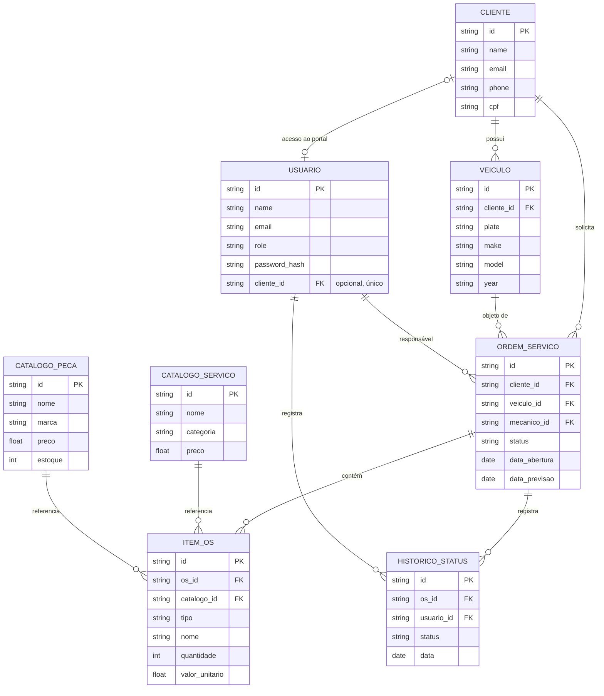

# Modelo Entidade-Relacionamento

> Modelo persistido em `apps/api/app/models/`, atualizado para a integração do portal (Fase 4).

O vínculo de portal é explícito: `usuarios.cliente_id` referencia `clientes.id`,
é opcional e único. Usuários sem vínculo não veem cadastros do portal. E-mail
não é usado como critério de autorização. A migration `6c4e91a2b730` adiciona
esse vínculo sem conceder acesso automaticamente a usuários existentes.
