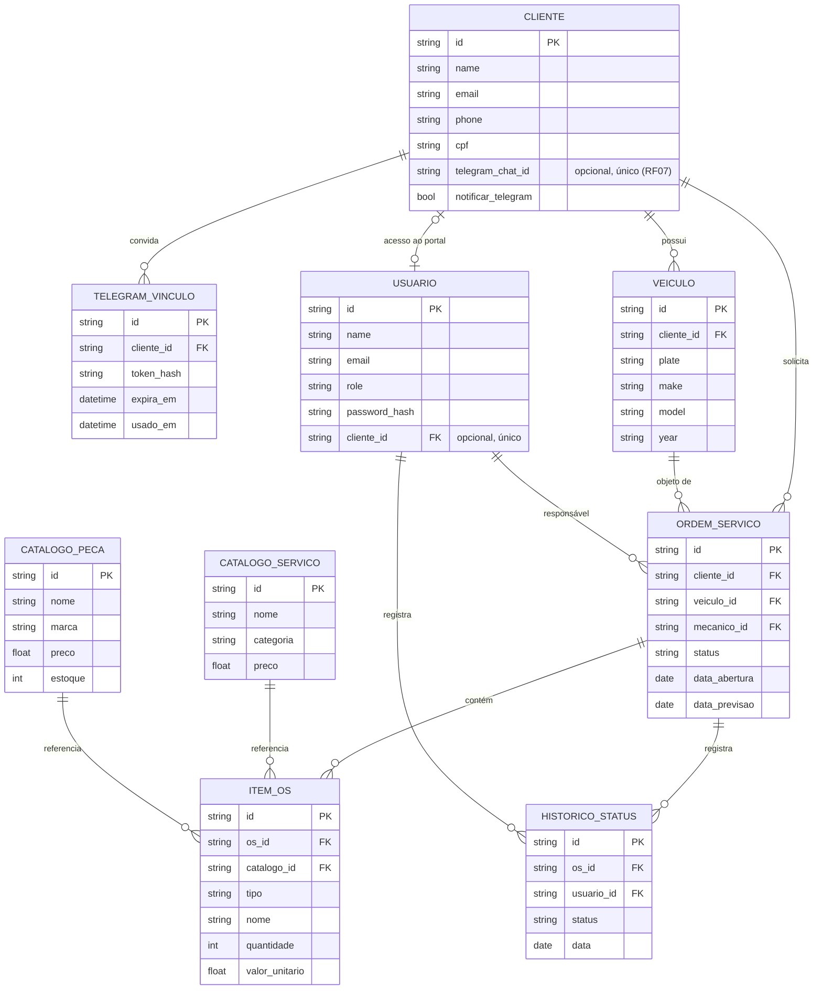

# Modelo Entidade-Relacionamento

> Modelo persistido em `apps/api/app/models/`, atualizado para a integração do portal (Fase 4).

O vínculo de portal é explícito: `usuarios.cliente_id` referencia `clientes.id`,
é opcional e único. Usuários sem vínculo não veem cadastros do portal. E-mail
não é usado como critério de autorização. A migration `6c4e91a2b730` adiciona
esse vínculo sem conceder acesso automaticamente a usuários existentes.

O RF07 (notificações por Telegram) adiciona `clientes.telegram_chat_id` (opcional e
único) e `clientes.notificar_telegram`, além da tabela `telegram_vinculos`, que guarda
apenas o hash do convite, com expiração e uso único. O `chat_id` só é gravado depois
que o próprio cliente abre o link do bot (opt-in). A migration é `8d2f5b7c1a94`.
