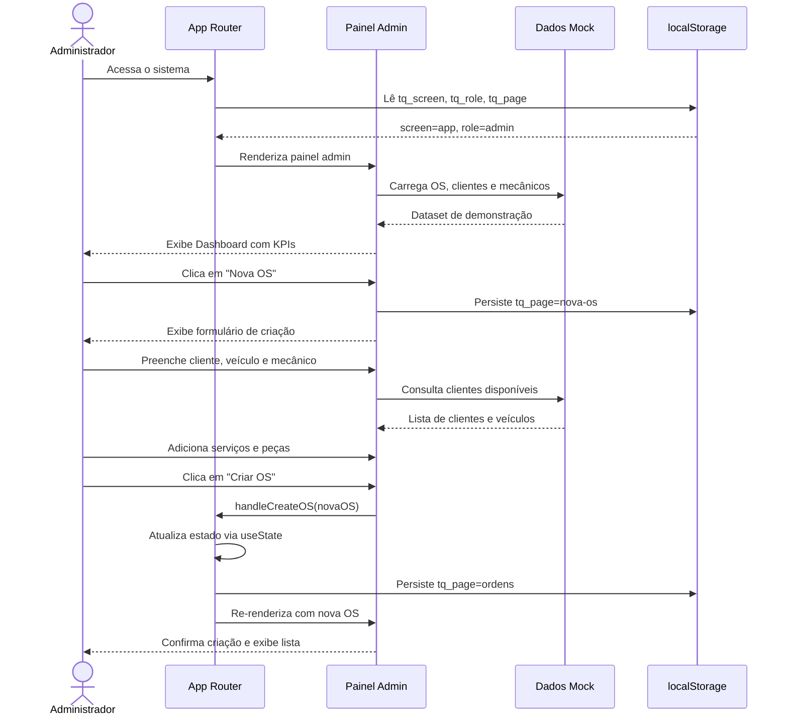

# Diagrama de Sequência — Abertura de uma Ordem de Serviço

```mermaid
sequenceDiagram
    actor Admin as Administrador
    participant Router as App Router
    participant Tela as Painel Admin
    participant Mock as Dados Mock
    participant LS as localStorage

    Admin->>Router: Acessa o sistema
    Router->>LS: Lê tq_screen, tq_role, tq_page
    LS-->>Router: screen=app, role=admin

    Router->>Tela: Renderiza painel admin
    Tela->>Mock: Carrega OS, clientes e mecânicos
    Mock-->>Tela: Dataset de demonstração
    Tela-->>Admin: Exibe Dashboard com KPIs

    Admin->>Tela: Clica em "Nova OS"
    Tela->>LS: Persiste tq_page=nova-os
    Tela-->>Admin: Exibe formulário de criação

    Admin->>Tela: Preenche cliente, veículo e mecânico
    Tela->>Mock: Consulta clientes disponíveis
    Mock-->>Tela: Lista de clientes e veículos
    Admin->>Tela: Adiciona serviços e peças
    Admin->>Tela: Clica em "Criar OS"

    Tela->>Router: handleCreateOS(novaOS)
    Router->>Router: Atualiza estado via useState
    Router->>LS: Persiste tq_page=ordens
    Router->>Tela: Re-renderiza com nova OS

    Tela-->>Admin: Confirma criação e exibe lista
```
